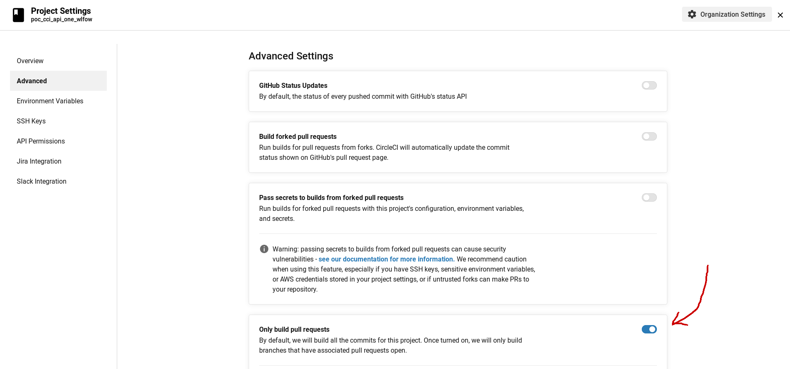

# poc_cci_api_one_wlfow

A test to proove that using the Circle CI API v2 to trigger a Pipeline, and a Circle CI pipeline definition .circleci/config.yml including at least two workflows, one can run only one Pipeline's Workflow, using the Circle CI API v2.

### The pull Requests Bot

* The Circle CI Pipeline where the pull request bot operates, must be configured to _"Only build pull requests"_ :



* The pull request bot will be triggered :
  * by any new pull request, on the source branch of the pull request
  * by any git pushed commit, on the source branch of any already existing pull request
* The pull request bot will not be triggered if the pipeline execution is triggered using the Circle Ci API v2, and providing the pipeline parameter `gio_action` has any of the enumeration values but the `pull_requests_bot` value.
* So the pull requests bot will then inspect the native Circle CI Env. Variables relative to pull requests, and :
  * if `gio_action` value is etiher of `product_release`, `lts_support_release`, or `sts_support_release`, then the pull requests bot is not triggered and only those
  * if `gio_action` value is `pull_requests_bot`, then :
    * the bot knows the trigger came either from the creation of a pull request, or a new commit on the source branch of an existing pull request.
    * the bot will then inspect the checked out git branch, and :
      * if the checked out git branch name `CIRCLE_BRANCH` starts with `support-`, then the bot will trigger again the pipeline, but this time with `gio_action` equals  `support_pr_review`, and on the source branch of the pull requests, which is exactly `CIRCLE_BRANCH`, like this :

```bash
export CCI_API_TOKEN='<The PR Bot Circle CI Token>'
export GIO_CICD_ACTION="support_pr_review"
export GIT_BRANCH="${CIRCLE_BRANCH}"
export PIPE_PARAMS="{ \"parameters\": { \"gio_action\": \"${GIO_CICD_ACTION}\" }, \"branch\": \"${GIT_BRANCH}\" }"
curl -d "${PIPE_PARAMS}" -X POST https://circleci.com/api/v2/project/gh/gravitee-lab/poc_cci_api_one_wlfow/pipeline -H 'Accept: application/json' -H 'Content-Type: application/json' -H "Circle-Token: ${CCI_API_TOKEN}" | jq .

```

      * if the checked out git branch name `CIRCLE_BRANCH` starts with `support-`, then the bot will trigger again the pipeline, but this time with `gio_action` equals  `dev_pr_review`, and on the source branch of the pull requests, which is exactly `CIRCLE_BRANCH`

```bash
export CCI_API_TOKEN='<The PR Bot Circle CI Token>'
export GIO_CICD_ACTION="dev_pr_review"
export GIT_BRANCH="${CIRCLE_BRANCH}"
export PIPE_PARAMS="{ \"parameters\": { \"gio_action\": \"${GIO_CICD_ACTION}\" }, \"branch\": \"${GIT_BRANCH}\" }"
curl -d "${PIPE_PARAMS}" -X POST https://circleci.com/api/v2/project/gh/gravitee-lab/poc_cci_api_one_wlfow/pipeline -H 'Accept: application/json' -H 'Content-Type: application/json' -H "Circle-Token: ${CCI_API_TOKEN}" | jq .

```

The Circle CI Pipeline where the bot operates, must be configured to "Only build pull requests"

Note that if the suppor team changes its git workflow, to ccreate support branches named
* with prefix `sts-`
* with pefix `lts-`
* instead of the prefix `support-`
* then the bot could easily be modified to trigger different workflows, for LTS and STS support sprint Pull Requests.


## Test the Pull Request Bot !

### "Only build pull requests" : CICD User Story

The initial state :

* The `3.0.x`, and `3.8.x` `git` branches exists, at least one commit has been git pushed to these git banches, and these have been created from the master branch
* The `./test-cases/1/init.sh` script, has been executed, which created the following `git` branches, and at least one commit has been git pushed to these git banches :
  * The `support-one-testcase1`, `issue-one-testcase1`, and `issue-two-testcase1` git branches have been created from the `3.0.1` git branch
  * The `support-two-testcase1`, `issue-three-testcase1`, and `issue-four-testcase1` git branches have been created from the `3.8.1` git branch
* The Circle CI project associated to this `git` repo has been configured to _"Only build pull requests"_ :


The steps of this Use Case :

  * **step 1 (trigger CircleCI `pull_requests_bot_exec` workflow)** Create a pull request from the `support-one-testcase1`, `issue-one-testcase1`, and `issue-two-testcase1` git branches, to the `3.0.1` git branch
    * **step 2 (trigger CircleCI `pull_requests_bot_exec` workflow)** git push a new commit on `support-one-testcase1`, `git` branch
    * **step 3 (trigger CircleCI `pull_requests_bot_exec` workflow)** git push a new commit on `issue-one-testcase1`, `git` branch
    * **step 4 (trigger CircleCI `pull_requests_bot_exec` workflow)** git push a new commit on `issue-two-testcase1`, `git` branch
  * **step 5 (trigger CircleCI `pull_requests_bot_exec` workflow)** Create a pull request from the `support-two-testcase1`, `issue-three-testcase1`, and `issue-four-testcase1` git branches, to the `3.8.1` git branch
    * **step 6 (trigger CircleCI `pull_requests_bot_exec` workflow)** git push a new commit on `support-one-testcase1`, `git` branch
    * **step 7 (trigger CircleCI `pull_requests_bot_exec` workflow)** git push a new commit on `issue-one-testcase1`, `git` branch
    * **step 8 (trigger CircleCI `pull_requests_bot_exec` workflow)** git push a new commit on `issue-two-testcase1`, `git` branch
  * **step 9 (trigger CircleCI `product_release, lts_support_release, sts_support_release, dev_pr_review, support_pr_review` workflows with Circle CI API v2)**
    * now let's trigger a single workflow of the pipeline, which is not the pull request bot (that's what the pull request bot will do) :

```bash
export CCI_API_TOKEN='xxxxxxxxxxxxxxxxxxxxx'

# Choose the workflow
export GIO_CICD_ACTION="product_release"
export GIO_CICD_ACTION="product_release_dry_run"
export GIO_CICD_ACTION="lts_support_release"
export GIO_CICD_ACTION="sts_support_release"
export GIO_CICD_ACTION="dev_pr_review"
export GIO_CICD_ACTION="support_pr_review"
export GIO_CICD_ACTION="build"

# Choose the branch
export GIT_BRANCH="master"
export GIT_BRANCH="develop"
export GIT_BRANCH="support-one-testcase1"
export GIT_BRANCH="issue-one-testcase1"
export GIT_BRANCH="issue-two-testcase1"
export GIT_BRANCH="support-two-testcase1"
export GIT_BRANCH="issue-three-testcase1"
export GIT_BRANCH="issue-four-testcase1"
export GIT_BRANCH="3.0.x"
export GIT_BRANCH="3.8.x"
export GIT_BRANCH="issue-test-dev_pr_review-cci-workflow"

export PIPE_PARAMS="{ \"parameters\": { \"gio_action\": \"${GIO_CICD_ACTION}\", \"pull_req_bot_image_tag\": \"stable-latest\" }, \"branch\": \"${GIT_BRANCH}\" }"

curl -d "${PIPE_PARAMS}" -X POST https://circleci.com/api/v2/project/gh/gravitee-lab/poc_cci_api_one_wlfow/pipeline -H 'Accept: application/json' -H 'Content-Type: application/json' -H "Circle-Token: ${CCI_API_TOKEN}" | jq .

```

All Circle CI native Env. Variables available in Pipelines : https://circleci.com/docs/2.0/env-vars/#built-in-environment-variables

### Triggering just one workflow of a given pipeline

* the page https://circleci.com/docs/2.0/api-job-trigger/ states :

>
>  It is possible to trigger workflows with the CircleCI API: a singular workflow can be re-run, or you may trigger a pipeline which will run its subsequent workflows.
>

So basically :

* You can re-run a workflow of a pipeline Definition
* You cannot run a workflow of a pipeline "for the first time".

So basically solution is to filter the desired workflow using branches filter.


# Added feature

on a different branch, using the git flow


# Now

Adding a new commit on branch `3.0.x` after releasing `3.0.2` on `master` branch

Adding a new commit on branch [3.0.x] after releasing [3.0.2] on [master] branch


# Finally

Added to make a new commit on `3.0.x` branch, and send a pull request, to trigger pipeline, and execute only `dev-pr-workflow` Circle CI Pipeline Workflow defined in [`./.circleci/config.yml`]
